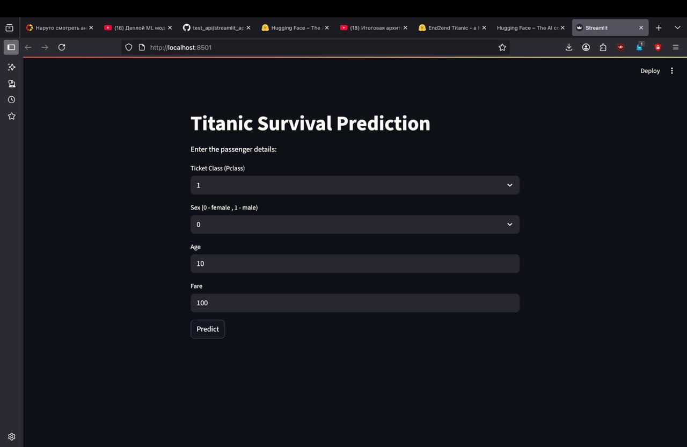

# 🚢 End2End-Titanic



**End2End-Titanic** — full **end-to-end machine learning project** predicting Titanic survival.
Includes **model training, API, frontend (Streamlit), and saved model** in `.pkl`.

---

## ✨ Features

* 🧩 **Complete ML pipeline**: preprocessing → model → inference.
* 📦 **Trained model** saved as `model.pkl`.
* 🌐 **REST API** for predictions with FastAPI.
* 🖥 **Interactive Streamlit frontend**.
* 🔄 **Supports user input** via API or frontend.
* ⚡ **Request counter & health check** for monitoring.

---

## ⚙️ Installation

```bash
git clone https://github.com/username/end2end-titanic.git
cd end2end-titanic
python -m venv venv
source venv/bin/activate  # Linux / Mac
venv\Scripts\activate     # Windows
pip install -r requirements.txt
```

---

## 🚀 Usage

### 1️⃣ Run API

```bash
uvicorn api:app --reload --host 0.0.0.0 --port 4000
```

* **Health check:** `GET /health` → `{"status":"OK"}`
* **Request stats:** `GET /stats` → `{"request_count": 0}`
* **Predict survival:** `POST /predict_model` with JSON:

```json
{
  "Pclass": 3,
  "Sex": 1,
  "Age": 22,
  "Fare": 7.25
}
```

Response:

```json
{
  "prediction": "Not Survived"
}
```

---

### 2️⃣ Run Frontend (Streamlit)

```bash
streamlit run app.py
```

* Enter passenger features in the sidebar.
* Get **real-time survival predictions**.

---

## 🗂 Project Structure

```
end2end-titanic/
│
├─ app.py               # Streamlit frontend
├─ api.py               # FastAPI backend
├─ model.pkl            # Trained ML model
├─ requirements.txt
├─ preview.jpg          # Project preview image
└─ README.md
```

---

## 🧩 Requirements

* Python 3.10+
* pandas
* scikit-learn
* pickle
* fastapi
* uvicorn
* streamlit
* pydantic

---

## 💡 Notes

* 🔄 Full end-to-end pipeline from input → prediction.
* ⚡ API includes **health** and **request stats** endpoints.
* 🖥 Streamlit frontend allows interactive testing without API calls.

